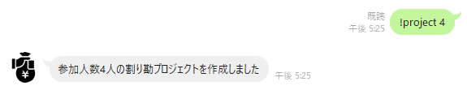
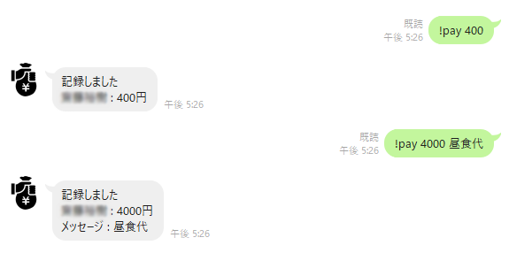
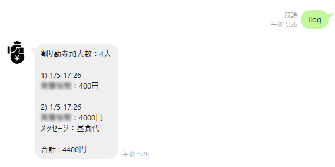
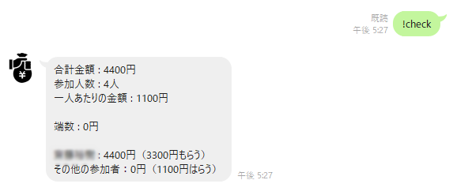
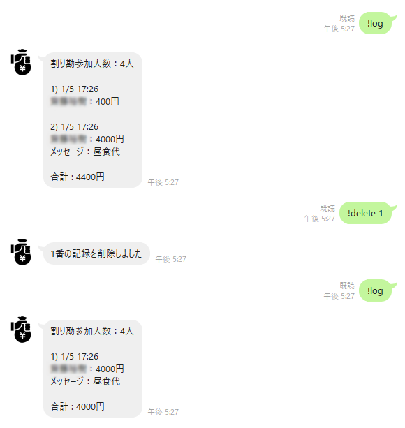

# warikanman
割り勘してくれるLINEbotです。  

下記のいくつかのコマンドは"!help"コマンドでも簡単に確認することができます。

# プロジェクト作成
project <参加人数>でプロジェクトを作成。

# 支払いを記録する
pay <支払った金額> <メッセージ> で、誰がいつ、何を、いくら支払ったかを記録する。

# ログを表示する。
logコマンドでプロジェクトが作成されてからの支払履歴が表示される。

# 割り勘する
checkコマンドにより誰がいくら支払うかの一覧を表示する。  
※checkコマンドを送信してもプロジェクトやログのデータが消去されることはない

# 履歴を消去する
delete <通し番号> コマンドによってlogに表示される番号の履歴を消去できる

# 注意点
- プロジェクトは1グループに1つまでしか作成できません。２つ目のプロジェクトを作成しようとした場合は、すでに作成されているものは削除され、新しくプロジェクトを作成することに注意してください。
- プロジェクト作成時に指定した参加人数を超える支払いの記録はできません。  
例えば、5人グループで"!project 3"と設定し、A君、B君、C君が支払い記録をした場合、プロジェクトへの参加者はこの３人であると決まり、他のD君、E君が支払い記録を追加することはできません。  

この仕様からも分かる通り、このサービスはプロジェクト参加人数の途中変更の可能性があることは考慮にいれていません。使い勝手が悪そうであれば今後変更を加えます。
